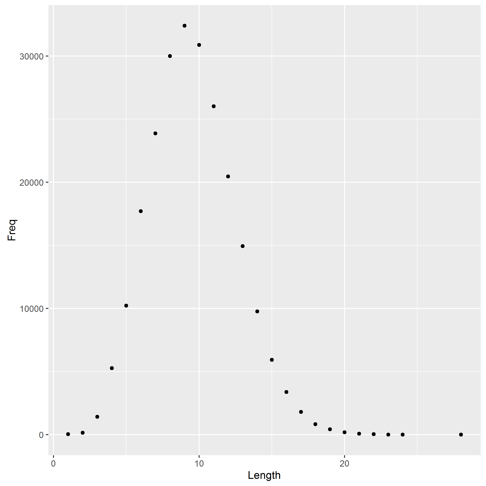

```{r setup, include=FALSE}
knitr::opts_chunk$set(echo = TRUE)
```

```{r}
word_data <- read.delim("histogram.tsv")
most_common_len <- word_data$Length[which.max(word_data$Freq)]
```

The most common word lengh is `r most_common_len` characters.
